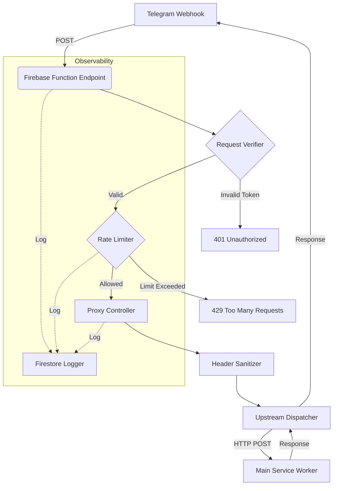

# Gateway Service

A high-performance, resilient Firebase Functions-based API gateway designed to securely proxy and rate-limit traffic between Telegram webhooks and downstream services. Built with TypeScript, it implements a custom in-memory token bucket rate limiter, strict request verification, and header sanitization.

## �️ Tech Stack

- **Runtime**: Node.js 24 (on Firebase Functions gen 2)
- **Framework**: Express.js 5.2.1
- **Language**: TypeScript 5.9
- **Core Dependencies**:
  - `firebase-admin`: For Firestore integration (logging)
  - `firebase-functions`: Serverless runtime
  - `node-fetch`: Upstream HTTP requests
- **Testing**: Jest + Supertest

## 🏗️ Technical Architecture

The service operates as a middleware-heavy Express application deployed on Firebase Cloud Functions.



### Request Lifecycle

1.  **Entry**: Request hits the Firebase Function entry point.
2.  **Verification**: `verifyTelegramRequest` middleware checks the `x-telegram-bot-api-secret-token` header against the secure `TELEGRAM_SECRET` env var.
3.  **Rate Limiting**: `inMemoryRateLimiter` ensures fair usage per Telegram User ID.
4.  **Header Processing**:
    - **Stripping**: Removes HTTP hop-by-hop headers (e.g., `connection`, `keep-alive`, `transfer-encoding`) to prevent proxy interference.
    - **Injection**: Adds `x-custom-request-sent-time` and `x-custom-client-id`.
    - **Forwarding**: Preserves `Content-Type` and strict `Host` routing.
5.  **Proxying**: Forwards the payload to `MAIN_SERVICE_ENDPOINT`.

## ⚡ Deep Dive: Rate Limiting

The service implements a **Token Bucket Algorithm** with lazy refilling for high efficiency and low overhead.

### Implementation Details
- **Storage**: In-memory `Map<string, RateLimitMapData>`.
- **Key Generation**: Unique `from.id` from the Telegram message body.
- **Algorithm**:
  - **Lazy Refill**: Tokens are recalculated only when a request arrives, based on `(now - lastRefillTime) * refillRate`.
  - **Burst Handling**: Capacitated bucket allows short bursts up to `maxTokens`.
- **Memory Management**: A dedicated `cleanupService` runs periodically (default: 10 mins) to iterate through the Map and evict stale entries (users inactive > `cleanUpWindow`), preventing memory leaks in long-running function instances.

### Response Headers
When rate limits are triggered or checked, standard `X-RateLimit-*` headers are injected:
- `X-RateLimit-Limit`: Max tokens allowed (bucket capacity).
- `X-RateLimit-Remaining`: Current tokens available.
- `X-RateLimit-Reset`: Unix timestamp when the bucket will be fully refilled.
- `Retry-After`: Seconds to wait before retrying (on 429).

## 📊 Logging & Observability

The service uses a structured logging pattern via `addLogToStore`. Logs are persisted to a Firestore collection (`loggerDb`) rather than just `console.log`.

**Log Levels**:
- `INFO`: Standard operational events (e.g., forwarding request).
- `ERROR`: Recoverable errors (e.g., upstream service hiccup).
- `CRITICAL_ERROR`: System stability threats (e.g., rate limiter misconfiguration).

## ⚙️ Configuration

### Environment Variables
Manage these via `firebase functions:secrets:set`.

| Variable | Description | Required |
|----------|-------------|----------|
| `TELEGRAM_SECRET` | Secret token expected in `x-telegram-bot-api-secret-token` | Yes |
| `MAIN_SERVICE_ENDPOINT` | Full URL of the upstream service | Yes |
| `MAIN_SERVICE_HOST` | Host header to send to upstream | Yes |
| `EXTERNAL_SERVICE_CALL_KEY` | Value for `x-custom-client-id` header sent upstream | No |

### Rate Limiter Settings
Configurable in `functions/src/rate-limiter/limiter-settings.ts`:
```typescript
export const rateLimiterSettings = {
    timeWindow: 60 * 1000,      // Window size (ms)
    tokens: 10,                 // Bucket capacity (Burst size)
    maxRefilTokens: 10,         // Refill rate per window
    costOfRequest: 1,           // Tokens consumed per request
    cleanUpWindow: 10 * 60 * 1000 // Stale data eviction interval
};
```

## 🚀 Development & Deployment

### Prerequisites
- Node.js 24+
- Firebase CLI (`npm i -g firebase-tools`)

### Local Emulation
Test the full logic locally including Firestore triggers and logs.
```bash
cd functions
npm run serve
```

### Deployment
Deploys with strict Node.js 24 runtime and 128MB memory allocation.
```bash
npm run deploy
```

## 🔒 Security Features

1.  **Secret Validation**: Zero-trust approach; requests without the correct Telegram secret are rejected immediately.
2.  **Header Sanitization**: Explicitly removes headers that could confuse upstream proxies:
    - `connection`, `keep-alive`, `proxy-authenticate`, `proxy-authorization`, `te`, `trailer`, `transfer-encoding`, `upgrade`.
3.  **Strict Typing**: Full TypeScript coverage (`src/types`) ensures compile-time safety for request bodies and error handling.

## 📝 API Contract

### POST /telegram

**Headers**
- `x-telegram-bot-api-secret-token`: [STRING] Auth token.

**Response Codes**
- `200 OK`: Proxy success.
- `400 Bad Request`: Missing upstream configuration or invalid request.
- `401 Unauthorized`: Invalid verification secret.
- `429 Too Many Requests`: Rate limit exceeded.
- `502 Bad Gateway`: Upstream service failed or unreachable.
